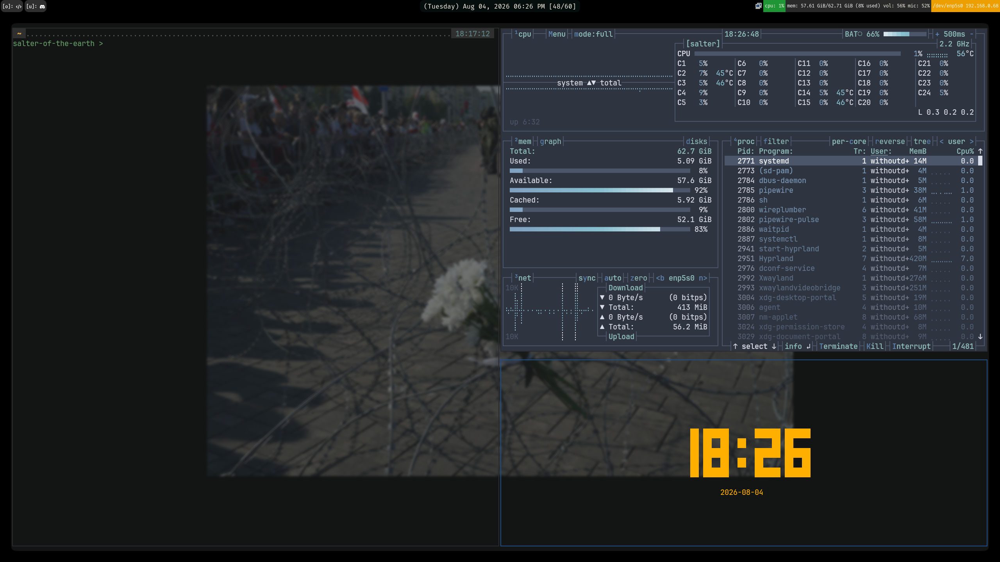

# finch's kitty configuration
hehe cat. 

Does not include the following software; BUT is configured to use them:
- [nnn](https://github.com/jarun/nnn)
- [spt (aliased from spotify_player)](https://github.com/aome510/spotify-player)
- [tty-clock](https://github.com/xorg62/tty-clock)
- [neovim](https://github.com/neovim/neovim)

## Looks like this:

